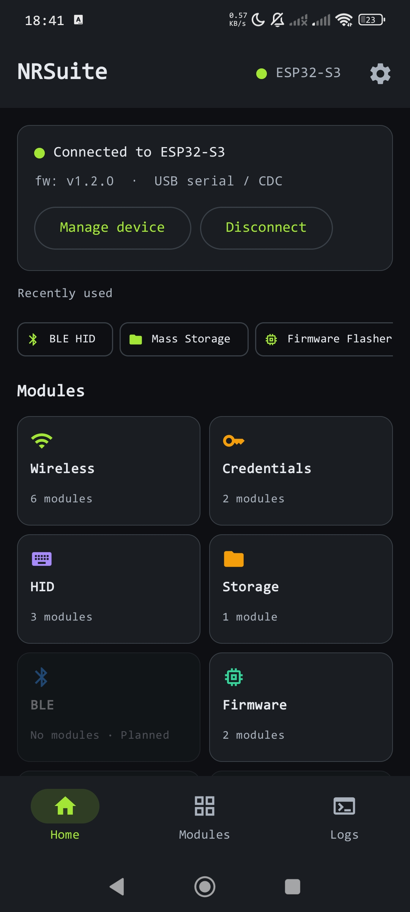
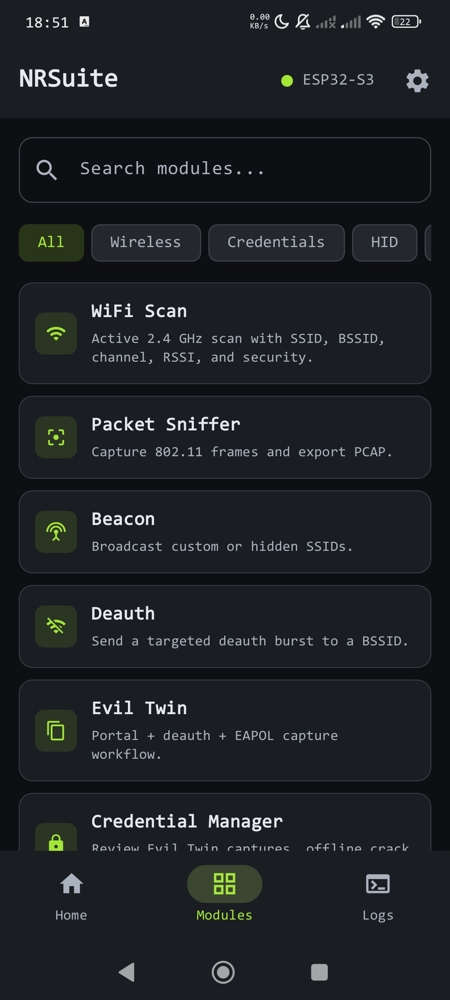
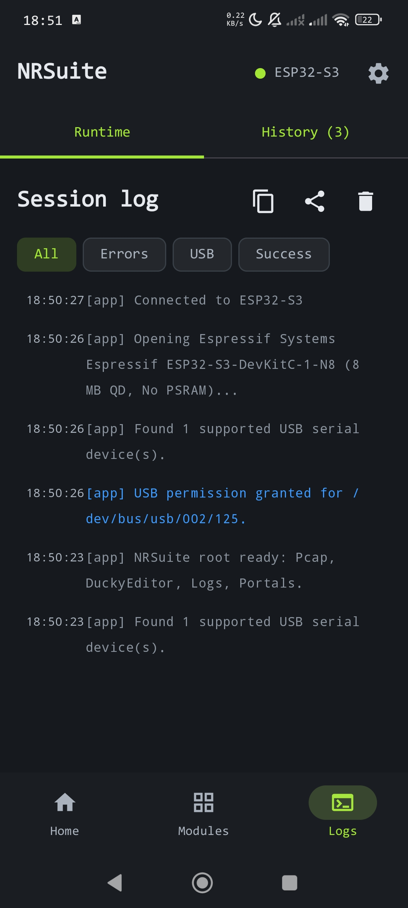
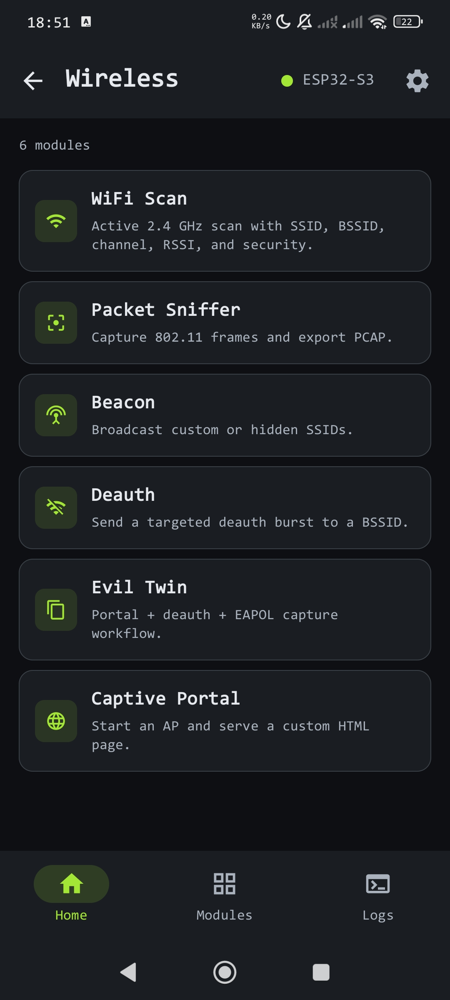
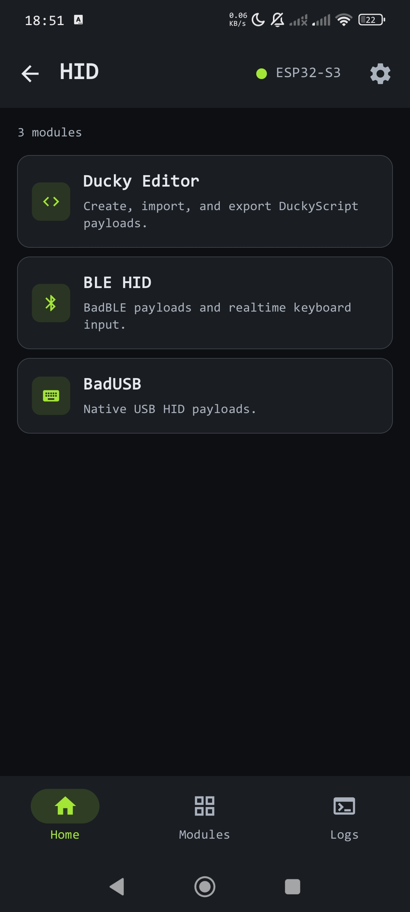
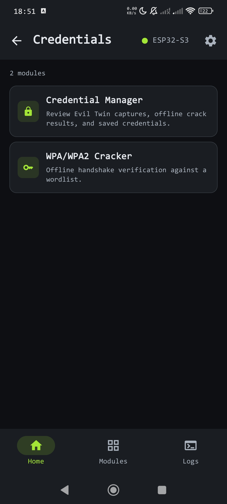
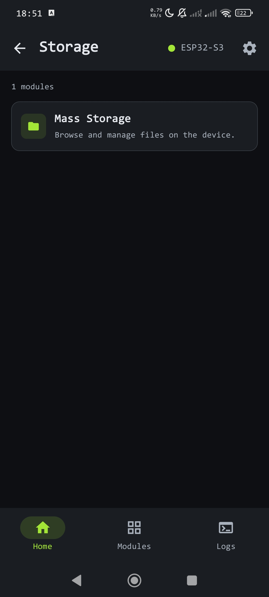
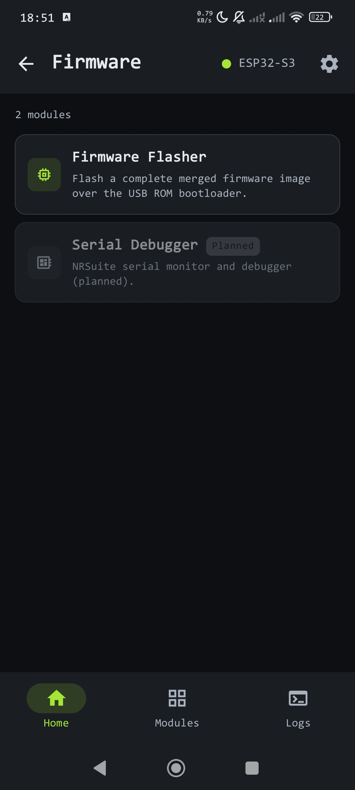
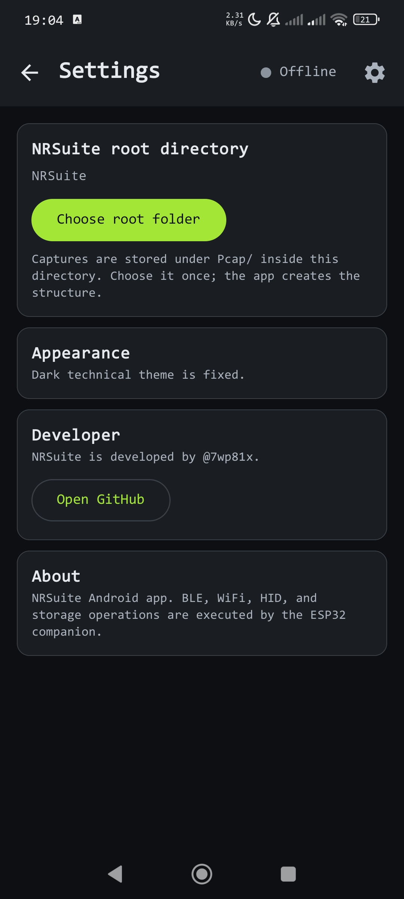

# NRSuite Android

**The Android companion app for the NRSuite security research toolkit.**

NRSuite Android connects to an ESP32 over USB-OTG (serial) and provides a full UI for launching Wi-Fi/BLE offense and defense modules, capturing pcap data, managing credentials, flashing firmware, and (in upcoming releases) coordinating a multi-node ESP-NOW mesh.

> **Authorized use only.** This tool is for security research and testing networks/devices you own or are explicitly authorized to test. See [LEGAL.md](./LEGAL.md).

---

## Screenshots

> Screenshots will be added when the beta build is released. If you want to contribute screenshots from your own device, see [CONTRIBUTING.md](./CONTRIBUTING.md).
check [screenshots](./Screenshots/) for more screenshots.

| Home | Modules | session logs |
|---|---|---|
|  |  |  |

| Wireless Modules | HID Modules | Creds Modules |
|---|---|---|
|  |  |  |

| Storage Modules | Firmware Modules | Settings |
|---|---|---|
|  |  |  |

---


## Features

### Current (v1.0.0-beta.1)

| Module | Description |
|---|---|
| Wi-Fi Scan | Passive AP and client discovery |
| Beacon Injection | Broadcast fake SSIDs |
| Deauthentication | Send deauth frames to targets |
| Evil Twin | Rogue AP with captive portal |
| Captive Portal | Custom HTML portal for credential capture |
| Packet Sniffer | Monitor-mode pcap capture and export |
| WPA Handshake Capture | Capture and crack WPA/WPA2 handshakes |
| BLE Scan | Bluetooth LE device discovery and interaction |
| BadUSB | HID injection via Ducky Script editor |
| Credential Manager | Local storage and management of captured credentials |
| ESP32 Flasher | Flash NRSuite firmware directly from the app over USB |

### Planned (see [FEATURES.md](./FEATURES.md))
- Defense modules: rogue AP detector, deauth detector, AirTag/tracker detector
- ESP-NOW mesh: multi-node coordination, distributed sensing, triangulation
- Mesh chat: encrypted offline team messaging
- Remote camera node support (ESP32-CAM)
- Sub-GHz, nRF24, RFID/NFC, IR peripheral modules
- LoRa long-range relay node support

---

## Requirements

### Device
- Android 8.0 (API 26) or higher
- USB-OTG support (required, the app uses USB host mode to communicate with the ESP32)
- USB-OTG cable or adapter

### Hardware
- Any ESP32 development board flashed with NRSuite firmware
- See [nrsuite-firmware](https://github.com/7wp81x/nrsuite-firmware) for supported boards and flashing instructions

---

## Installation

### Option A: Install prebuilt APK (recommended for beta)

1. Download the latest `nrsuite-vX.X.X-beta.apk` from [Releases](../../releases)
2. Verify the SHA256 checksum listed in the release notes before installing:
   ```
   # Linux/macOS
   sha256sum nrsuite-vX.X.X-beta.apk

   # Windows (PowerShell)
   certutil -hashfile nrsuite-vX.X.X-beta.apk SHA256
   ```
3. Enable "Install from unknown sources" on your device if needed (Settings -> Security)
4. Install the APK

### Option B: Build from source

See [Building](#building) below.

---

## Getting Started

1. Flash NRSuite firmware to your ESP32 (you can do this from inside the app via the built-in flasher, or via PlatformIO from [nrsuite-firmware](https://github.com/7wp81x/nrsuite-firmware))
2. Connect your ESP32 to your phone using a USB-OTG cable
3. Open NRSuite (it will auto-detect the connected device)
4. Grant USB host permission when prompted (one-time per device)
5. Select a module from the home screen

---

## Building

### Prerequisites
- Android Studio Ladybug or newer (latest stable recommended)
- JDK 11 (bundled with Android Studio)
- Android SDK with API 36 (compileSdk) and API 26 (minSdk) installed

### Steps

```bash
git clone https://github.com/7wp81x/nrsuite-android.git
cd nrsuite-android
```

Open in Android Studio and sync Gradle, or build via CLI:

```bash
# Debug build
./gradlew assembleDebug

# Output: app/build/outputs/apk/debug/app-debug.apk
```

Signed release APKs are published by the maintainer. If you just want to test your changes, the debug build is all you need.

---

## Project Structure

```
app/src/main/java/com/swp81x/nrsuite/
  core/
    credentials/      # Credential storage models and store
    eapol/            # EAPOL frame parser (for WPA handshake capture)
    flasher/          # ESP32 in-app flasher (SLIP codec, USB serial transport)
    history/          # Session history entries
    pcap/             # Pcap file reader and writer
    protocol/         # Frame codec and NrJson wire protocol (shared with firmware)
    session/          # Connection state and NrSession manager
    sniff/            # Sniff request model
    usb/              # USB serial transport, device catalog, NrTransport
    wifi/             # Pcap SSID parser
    wpa/              # WPA handshake parser, verifier, and cracker
  service/
    NrSuiteForegroundService.kt   # Foreground service keeping USB session alive
  ui/
    components/       # Reusable Compose components
    theme/            # Color, typography, theme
    NRSuiteApp.kt     # App entry point and module catalog
    NRSuiteContent.kt # Shell navigation, permission flow, screen dispatch
    HomeScreen.kt     # Dashboard, categories, module list
    LogsScreen.kt     # Logs and session history
    DeviceScreen.kt   # USB device selection and connection state
    SettingsScreen.kt # Settings and firmware flasher
    *Screen.kt        # Feature module screens
  MainActivity.kt
  MainViewModel.kt             # Application-scoped controller
  MainViewModelUsb.kt          # USB discovery, permission, connection lifecycle
  MainViewModelFlasher.kt      # Firmware image selection and flashing
  MainViewModelWifi.kt         # Scan, deauth, beacon, sniff
  MainViewModelPortal.kt       # Captive Portal and Evil Twin
  MainViewModelBle.kt          # BLE HID
  MainViewModelStorage.kt      # Mass storage, BadUSB, DuckyScript
  MainViewModelCredentials.kt  # Credential sessions and WPA cracking
  NrSuiteApplication.kt
```

---

## Wire Protocol

NRSuite uses a custom framing protocol (`FrameCodec` / `NrJson`) over USB serial to communicate between the app and the ESP32 firmware. The protocol spec is versioned separately in [nrsuite-protocol](https://github.com/7wp81x/nrsuite-protocol) so the app and firmware can evolve independently without silent breaking changes.

If your contribution touches any app <-> firmware communication, update the protocol spec first and reference the spec version in your PR.

---

## Contributing

See [CONTRIBUTING.md](./CONTRIBUTING.md) for the full guide: branching model, PR process, testing expectations, and legal/ethical scope boundaries.

Short version:
- Open an issue before starting any nontrivial feature
- Branch from `develop`, not `main`
- One feature or fix per PR
- Test on real hardware for anything touching USB serial, the flasher, or module screens
- Jamming features (RF/Wi-Fi/BLE denial-of-service transmission) will not be merged, see CONTRIBUTING.md

---

## Related Repos

| Repo | Contents |
|---|---|
| [nrsuite-firmware](https://github.com/7wp81x/nrsuite-firmware) | ESP32 firmware (PlatformIO/ESP-IDF) |
| [nrsuite-protocol](https://github.com/7wp81x/nrsuite-protocol) | Wire protocol specification |

---

## Versioning and Compatibility

| App version | Firmware version | Protocol spec |
|---|---|---|
| v1.0.0-beta.1 | v1.0.0-beta.1 | v1.0 |

This table is updated with each release. Always check compatibility before mixing app and firmware versions.

---

## Security

If you find a vulnerability in NRSuite itself (for example, a flaw in the mesh encryption scheme, credential storage, or the USB flasher), please report it privately rather than opening a public issue. See [SECURITY.md](./SECURITY.md).

---

## License

[MIT](./LICENSE)

This license covers redistribution of the code. It does not authorize use of the tool against systems you do not own or lack permission to test. See [LEGAL.md](./LEGAL.md).
