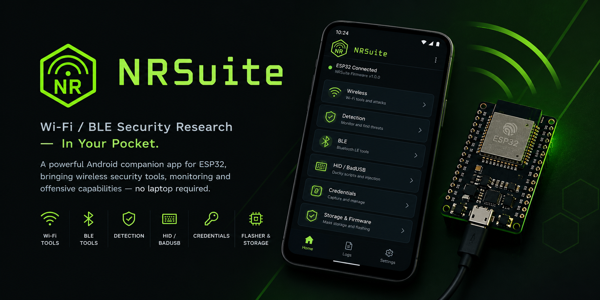

# NRSuite

NRSuite is an Android companion app paired with custom ESP32 firmware, built to bring Wi-Fi and BLE security research tooling into a fast, portable phone-based workflow - no laptop required.

It connects to any ESP32 dev board flashed with NRSuite firmware over USB-OTG (serial), and drives it as a Wi-Fi/BLE offense and defense platform.

> **Authorized use only.** NRSuite is for security research and testing on networks and devices you own or are explicitly authorized to test. See [LEGAL.md](./LEGAL.md).

---

## Community

Join the NRSuite Discord server for setup help, build showcases, release news, and development discussion:

[](https://discord.gg/nnU9QSX5UZ)

Use `#support` for help, `#showcase` for builds, and `#github` for repo/code discussion.

---

## Table of Contents

- [Community](#community)
- [Features](#features)
- [Installation](#installation)
- [Getting Started](#getting-started)
- [Requirements](#requirements)
- [Building from Source](#building-from-source)
- [Wire Protocol](#wire-protocol)
- [Screenshots](#screenshots)
- [Hardware Images](#hardware-images)
- [Contributing](#contributing)
- [Related Repos](#related-repos)
- [Versioning](#versioning--compatibility)
- [License](#license)

---

## Features

<details>
<summary><strong>Wireless</strong></summary>

- [x] **Wi-Fi Scan** - AP/channel discovery with SSID, BSSID, RSSI, security, and WPS flags
- [x] **Beacon Spam** - broadcast custom or hidden SSIDs
- [x] **Deauthentication** - deauth frame injection
- [x] **Evil Twin** - rogue AP with captive portal
- [x] **Captive Portal** - custom HTML credential capture
- [x] **Packet Sniffer** - monitor-mode capture with PCAP export
- [x] **Hidden AP Revealer** - passive hidden AP detection, probe-request SSID candidates, and association-based SSID resolution
- [ ] **PMKID Capture**

</details>

<details>
<summary><strong>Detection</strong></summary>

- [x] **Deauth Detector** - passive deauth/disassoc monitoring with BSSID, client, RSSI, and reason filters; async alerts; live logs
- [x] **Rogue AP Detector** - compares nearby visible APs and OUI rules to flag duplicate SSIDs, security downgrades, and suspected impersonation
- [x] **Client/Presence Detector** - passive probe/assoc/reassoc/auth monitoring with optional active deauth-trigger mode
- [x] **Tracker Detector** - Find My / AirTag-style advertisement detection with repeated sightings
- [ ] **Karma/MANA Detector**
- [ ] **Unauthorized RFID Reader Detector**
- [ ] **Jam Detector** (detection only - see [FEATURES.md](./FEATURES.md#explicitly-out-of-scope))

</details>

<details>
<summary><strong>BLE</strong></summary>

- [x] **BLE Scanner** - device discovery with names, RSSI, manufacturer data, service UUIDs, and service badges
- [x] **BLE GATT Profile** - read-only service/characteristic enumeration with integrated BLE target scanner
- [x] **BLE HID** - Bluetooth LE keyboard/mouse HID and DuckyScript payloads
- [ ] **FastPair Model Identification** - map FastPair model IDs to known device names/types

</details>

<details>
<summary><strong>HID / BadUSB</strong></summary>

- [x] **Ducky Script Editor** - create, import, and export DuckyScript payloads
- [x] **BadUSB** - HID injection via USB
- [x] **Multi-device USB sessions** - connect and use multiple USB serial devices independently, with per-device permissions and connection state
- [x] **BadUSB device picker** - choose the target USB device without interrupting other connections

</details>

<details>
<summary><strong>Credentials</strong></summary>

- [x] **WPA Handshake Capture/Crack** - capture and offline dictionary cracking
- [x] **Credential Manager** - local storage and management of captured credentials

</details>

<details>
<summary><strong>Storage, Firmware & Tools</strong></summary>

- [x] **Mass Storage** - list/delete files on ESP32 flash and enter USB MSC mode
- [x] **ESP32 Flasher** - flash NRSuite firmware directly from the app over USB
- [x] **Serial Monitor** - raw USB serial monitor for any ESP32 or USB-UART firmware
- [x] **MAC Lookup** - offline OUI/vendor lookup for any MAC address
- [x] **Persistent firmware device ID** - `NRxxxxxxx` NVS ID shown in the app so devices remain identifiable across reconnects

</details>

### Visible but not yet functional

The following modules appear in the app as disabled ("Unavailable") placeholder cards, reserving their place in the catalog ahead of firmware support:

- [ ] **IR** (infrared transmit/receive)
- [ ] **RF** (Sub-GHz)
- [ ] **RFID/NFC**

### Planned

For a full status and roadmap breakdown across every phase, see [FEATURES.md](./FEATURES.md).

<details>
<summary><strong>Mesh (ESP-NOW) - Planned</strong></summary>

- [ ] **Shared Group Key Provisioning**
- [ ] **Dynamic Master Election**
- [ ] **Client Idle/Standby Mode**
- [ ] **Encrypted ESP-NOW Transport**
- [ ] **Activation Handshake**
- [ ] **Session Locking**
- [ ] **Heartbeat/Auto-Timeout**
- [ ] **Distributed Sensor Reporting**
- [ ] **Triangulation Engine**

</details>

<details>
<summary><strong>Mesh Chat - Planned</strong></summary>

- [ ] **ESP-NOW Chat Transport**
- [ ] **Multi-hop Relay**
- [ ] **Store-and-Forward**
- [ ] **Message Fragmentation**
- [ ] **Sender Aliases**
- [ ] **Quick/Canned Messages**
- [ ] **Chat/Sensor Traffic Prioritization**

</details>

<details>
<summary><strong>Remote Camera Node - Planned</strong></summary>

- [ ] **Live Feed Streaming**
- [ ] **Snapshot-on-Trigger**
- [ ] **Motion Detection**
- [ ] **Deep-sleep/Low-power Mode**
- [ ] **SD Card Buffering**
- [ ] **Mesh Manager Integration**

</details>

<details>
<summary><strong>Peripheral Radios - Planned</strong></summary>

- [ ] **IR** - Capture/Replay, Universal Remote DB, TV-off brute-force
- [ ] **Sub-GHz (CC1101)** - Scanner, Capture/Replay, Protocol Decoder
- [ ] **nRF24** - RC/Device Scanner, MouseJack-style analysis, Packet Sniffer
- [ ] **RFID/NFC** - Read, Emulate, Write/Clone, Access Control Analyzer
- [ ] **LoRa** - long-range relay node support

</details>

---

## Installation

### Option A - Prebuilt APK (recommended for beta)

1. Download the latest `nrsuite-vX.X.X-beta.apk` from [Releases](../../releases).
2. Verify the SHA256 checksum listed in the release notes before installing:
   ```sh
   # Linux / macOS
   sha256sum nrsuite-vX.X.X-beta.apk

   # Windows (PowerShell)
   certutil -hashfile nrsuite-vX.X.X-beta.apk SHA256
   ```
3. Enable **Install from unknown sources** on your device if needed - Settings → Security.
4. Install the APK.

### Option B - Build from source

```sh
git clone https://github.com/7wp81x/nrsuite-android.git
cd nrsuite-android
./gradlew assembleDebug
```

Output: `app/build/outputs/apk/debug/app-debug.apk`

You can also open the project in Android Studio and sync Gradle - see [Building from Source](#building-from-source) for prerequisites.

### Flashing the ESP32

You also need an ESP32 dev board flashed with NRSuite firmware. Flash it directly from inside the app using the built-in flasher, or manually via PlatformIO - see [nrsuite-firmware](https://github.com/7wp81x/nrsuite-firmware) for supported boards and instructions.

---

## Getting Started

1. Flash NRSuite firmware to your ESP32 - use the in-app flasher, or PlatformIO from [nrsuite-firmware](https://github.com/7wp81x/nrsuite-firmware).
2. Connect your ESP32 to your phone via a USB-OTG cable.
3. Open NRSuite - the app auto-detects the connected device.
4. Grant USB host permission when prompted (one-time per device).
5. Select a module from the home screen and start testing.

---

## Requirements

### Android device

- Android 8.0 (API 26) or higher
- USB-OTG support (required - the app uses USB host mode to communicate with the ESP32)
- USB-OTG cable or adapter

### Hardware

- Any ESP32 development board flashed with NRSuite firmware
- See [nrsuite-firmware](https://github.com/7wp81x/nrsuite-firmware) for supported boards and flashing instructions

---

## Building from Source

### Prerequisites

- Android Studio Ladybug or newer (latest stable recommended)
- JDK 11 (bundled with Android Studio)
- Android SDK with API 36 (`compileSdk`) and API 26 (`minSdk`) installed

### Steps

```sh
git clone https://github.com/7wp81x/nrsuite-android.git
cd nrsuite-android
./gradlew assembleDebug
```

Signed release APKs are published by the maintainer. For testing your own changes, the debug build is sufficient.

### Project Structure

```
app/src/main/java/com/swp81x/nrsuite/
  core/
    ble/               # BLE scan/profile/tracker models and scan limits
    credentials/       # Credential storage models and store
    defense/           # Rogue AP / client-presence / hidden-AP / deauth-alert models, OUI heuristics
    eapol/             # EAPOL frame parser (for WPA handshake capture)
    flasher/           # ESP32 in-app flasher (SLIP codec, USB serial transport)
    history/           # Session history entries
    log/               # Log entry model (Logs screen, live module logs)
    oui/               # Offline OUI/vendor database (MAC Lookup, defense modules)
    pcap/              # Pcap file reader and writer
    protocol/          # Frame codec and NrJson wire protocol (shared with firmware)
    session/           # Connection state and NrSession manager
    sniff/             # Sniff request model
    storage/           # Mass storage models (ESP32 flash file browser)
    usb/               # USB serial transport, device catalog, NrTransport
    wifi/              # Pcap SSID parser
    wpa/               # WPA handshake parser, verifier, and cracker
  service/
    NrSuiteForegroundService.kt   # Foreground service keeping USB session alive
  ui/
    components/       # Reusable Compose components
    theme/            # Color, typography, theme
    NRSuiteApp.kt     # App entry point and module catalog
    NRSuiteContent.kt # Shell navigation, permission flow, screen dispatch
    HomeScreen.kt     # Dashboard, categories, module list
    LogsScreen.kt     # Logs and session history
    DeviceScreen.kt   # USB device selection and connection state
    SettingsScreen.kt # Settings and firmware flasher
    ModuleAvailability.kt # Shared "module unavailable on this board" banner/FAB gating
    RogueApScreen.kt / DeauthDetectorScreen.kt / ClientPresenceScreen.kt /
    HiddenApScreen.kt / TrackerDetectorScreen.kt   # Defense modules
    BleScannerScreen.kt / BleProfileScreen.kt / BleScreen.kt   # BLE recon + BLE HID
    MacLookupScreen.kt / SerialMonitorScreen.kt    # Tools / firmware utilities
    *Screen.kt        # Remaining feature module screens
  MainActivity.kt
  MainViewModel.kt               # Application-scoped controller
  MainViewModelUsb.kt            # USB discovery, permission, connection lifecycle
  MainViewModelFlasher.kt        # Firmware image selection and flashing
  MainViewModelWifi.kt           # Scan, deauth, beacon, sniff
  MainViewModelPortal.kt         # Captive Portal and Evil Twin
  MainViewModelBle.kt            # BLE HID
  MainViewModelBleScanner.kt     # BLE device discovery
  MainViewModelBleProfile.kt     # BLE GATT enumeration
  MainViewModelStorage.kt        # Mass storage, BadUSB, DuckyScript
  MainViewModelCredentials.kt    # Credential sessions and WPA cracking
  MainViewModelDefense.kt        # Shared defense-module plumbing
  MainViewModelRogueAp.kt        # Rogue AP Detector
  MainViewModelHiddenAp.kt       # Hidden AP Revealer
  MainViewModelClientPresence.kt # Client Detector
  MainViewModelTracker.kt        # Tracker Detector
  MainViewModelOui.kt            # MAC Lookup
  MainViewModelSerialMonitor.kt  # Serial Monitor
  NrSuiteApplication.kt
```

---

## Wire Protocol

NRSuite uses a custom framing protocol (`FrameCodec` / `NrJson`) over USB serial between the app and the ESP32 firmware. The protocol spec is versioned separately in [nrsuite-protocol](https://github.com/7wp81x/nrsuite-protocol) so the app and firmware can evolve independently without silent breaking changes.

> If your contribution touches any app ↔ firmware communication, **update the protocol spec first** and reference the spec version in your PR.

---

## Screenshots

| Home | Modules | Logs |
|---|---|---|
|  |  |  |

| Device Manager | WiFi Scan | Packet Sniffer |
|---|---|---|
|  |  |  |

| Deauth Detector | Rogue AP Detector | BLE Scanner |
|---|---|---|
|  |  |  |

| BadUSB | Credential Manager | Firmware Flasher |
|---|---|---|
|  |  |  |

More screenshots in [./screenshots/](./screenshots/).

---

## Hardware Images

| USB hub + ESP32-S2 | ESP32-S3 SuperMini |
|---|---|
|  |  |

---

## Contributing

See [CONTRIBUTING.md](./CONTRIBUTING.md) for the full guide: branching model, PR process, testing expectations, and legal/ethical scope boundaries.

**Short version:**

- Open an issue before starting any non-trivial feature.
- Branch from `develop`, not `main`.
- One feature or fix per PR.
- Test on real hardware for anything touching USB serial, the flasher, or module screens.
- Jamming features (RF/Wi-Fi/BLE denial-of-service transmission) will not be merged - see [CONTRIBUTING.md](./CONTRIBUTING.md).

---

## Related Repos

| Repo | Contents |
|---|---|
| [nrsuite-firmware](https://github.com/7wp81x/nrsuite-firmware) | ESP32 firmware (PlatformIO / ESP-IDF) |
| [nrsuite-protocol](https://github.com/7wp81x/nrsuite-protocol) | Wire protocol specification |

---

## Versioning & Compatibility

| App version | Firmware version | Protocol spec |
|---|---|---|
| v1.0.0-beta.2 | v1.0.0-beta.2 | v1.0 |

This table is updated with each release. Always check compatibility before mixing app and firmware versions.

---

## Security

If you find a vulnerability in NRSuite itself (for example, a flaw in the mesh encryption scheme, credential storage, or the USB flasher), please report it privately rather than opening a public issue. See [SECURITY.md](./SECURITY.md).

---

## License

[MIT](./LICENSE)

This license covers redistribution of the code. It does not authorize use of the tool against systems you do not own or lack explicit permission to test. See [LEGAL.md](./LEGAL.md).

---

## Disclaimer

NRSuite is a tool for security research and authorized red-team operations, intended for legal and authorized security testing purposes only. Use of this software for any malicious or unauthorized activity is strictly prohibited. By downloading, installing, or using NRSuite, you agree to comply with all applicable laws and regulations. This software is provided free of charge; the developers assume no liability for any misuse. Use at your own risk. See [LEGAL.md](./LEGAL.md) for full terms.
